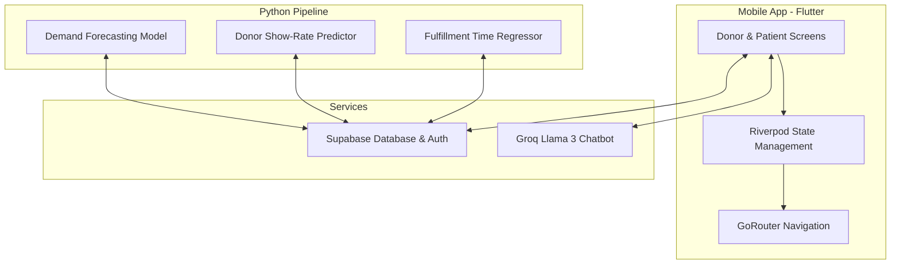

# Hayat (حياة) - Intelligent Blood Donation Platform

<div align="center">
  
  [](#crown-prince-award)
  
  [](https://flutter.dev)
  [](https://dart.dev)
  [](https://supabase.com)
  [](https://python.org)
  [](https://scikit-learn.org)
  [](https://groq.com)

  **A smart, gamified mobile application and machine learning system connecting blood donors with patients in Jordan.**
</div>

---

## 🏆 Crown Prince Award Submission
This project was developed and submitted as an innovation entry for the prestigious **Crown Prince Award** in Jordan. It addresses critical healthcare challenges in Jordan's national blood supply chain by introducing predictive artificial intelligence and modern mobile gamification to motivate, track, and streamline blood donation nationwide.

---

## 📌 Problem Statement & Solution

### The Challenge in Jordan:
1. **Critical Timing**: Finding matching blood donors in emergencies relies on disorganized social media posts or manual calls, causing life-threatening delays.
2. **Donor Retention**: Low rates of recurring donors and a lack of structured incentives/gamification.
3. **Supply Discrepancy**: Blood banks and hospitals frequently experience either acute shortages or wastage due to poor demand forecasting.

### The Hayat Solution:
Hayat connects the entire blood donation ecosystem—Donors, Patients, Hospitals, and Blood Banks—into a single digital network powered by Machine Learning:
* **For Donors**: A premium Flutter mobile app offering a gamified reward store (redeemable coupons) and a smart pre-donation eligibility check.
* **For Patients & Families**: Instant blood request creation with automated smart-matching that prioritizes donors most likely to show up.
* **For Health Authorities (Ministry of Health)**: Time-series ML demand forecasting to predict blood supply requirements 7 days in advance.

---

## 🛠️ System Architecture



---

## ✨ Features

### 📱 Flutter Mobile App (`/hayat`)
* **Gamification & Rewards**: Earn points on every donation to redeem rewards/coupons from local partners.
* **AI Health Chatbot**: Integrated Groq AI assistant (Llama-3-8B) to answer donation FAQs, evaluate criteria, and locate hospitals.
* **Streamlined Requests**: Create and track urgent blood requests in real time.
* **Bilingual Support**: Full localization support for English and Arabic.

### 🧠 Machine Learning Engine (`/hayat/blood_donation_ml`)
* **Time-Series Demand Forecasting**: Predicts blood needs per hospital and blood type 7 days ahead.
* **Donor Engagement Scoring**: Analyzes donor profile data to score show rates, helping prioritize donor outreach.
* **Request Fulfillment Regression**: Estimates blood request fulfillment duration to manage patient expectations.
* **Synthetic Data Scaling**: A data simulation pipeline mapping realistic demographics, cities, and MoH structures in Jordan (30,000+ synthetic profiles).

---

## 🚀 Getting Started

### Prerequisites
* Flutter SDK (`^3.9.2` or later)
* Dart SDK
* Python 3.10+
* A Supabase account

---

### Backend / Environment Setup

1. Copy `.env.example` to `.env` in both the root directory and the `hayat/` directory:
   ```bash
   cp .env.example .env
   cp .env.example hayat/.env
   ```
2. Fill in your Supabase details and Groq API keys in the respective `.env` files:
   ```env
   SUPABASE_URL=https://your-project.supabase.co
   SUPABASE_ANON_KEY=your-anon-key
   GROQ_API_KEY=your-groq-api-key
   ```

---

### Running the Mobile App

Navigate into the `hayat` directory:
```bash
cd hayat

# Fetch dependencies
flutter pub get

# Run on an emulator or connected device
flutter run

# Run on Chrome
flutter run -d chrome
```

---

### Running the Machine Learning Models

Navigate into the ML directory:
```bash
cd hayat/blood_donation_ml

# Install dependencies
pip install -r requirements.txt

# Run the training script for all models
python train_all.py
```

---

## 👥 Contributors & Credits
Developed as an entry for the **Crown Prince Award** for digital innovations improving healthcare logistics in Jordan.
